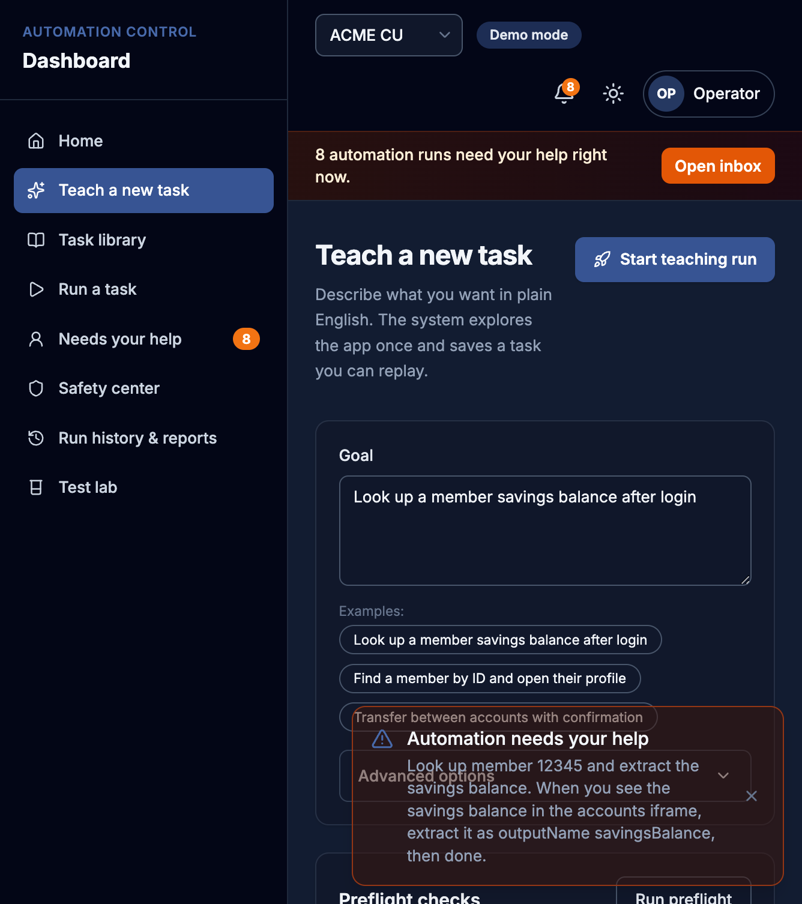
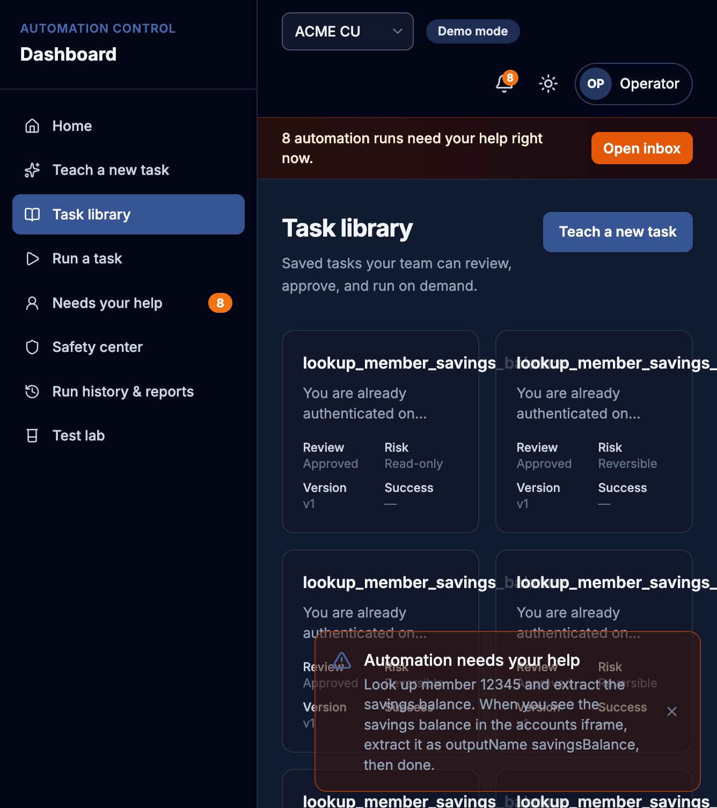
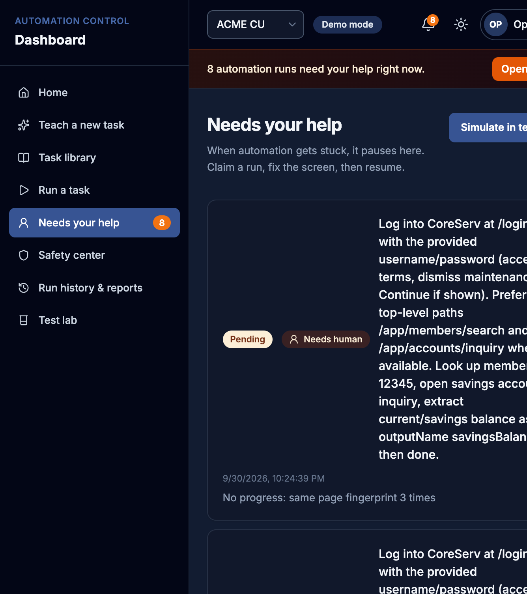
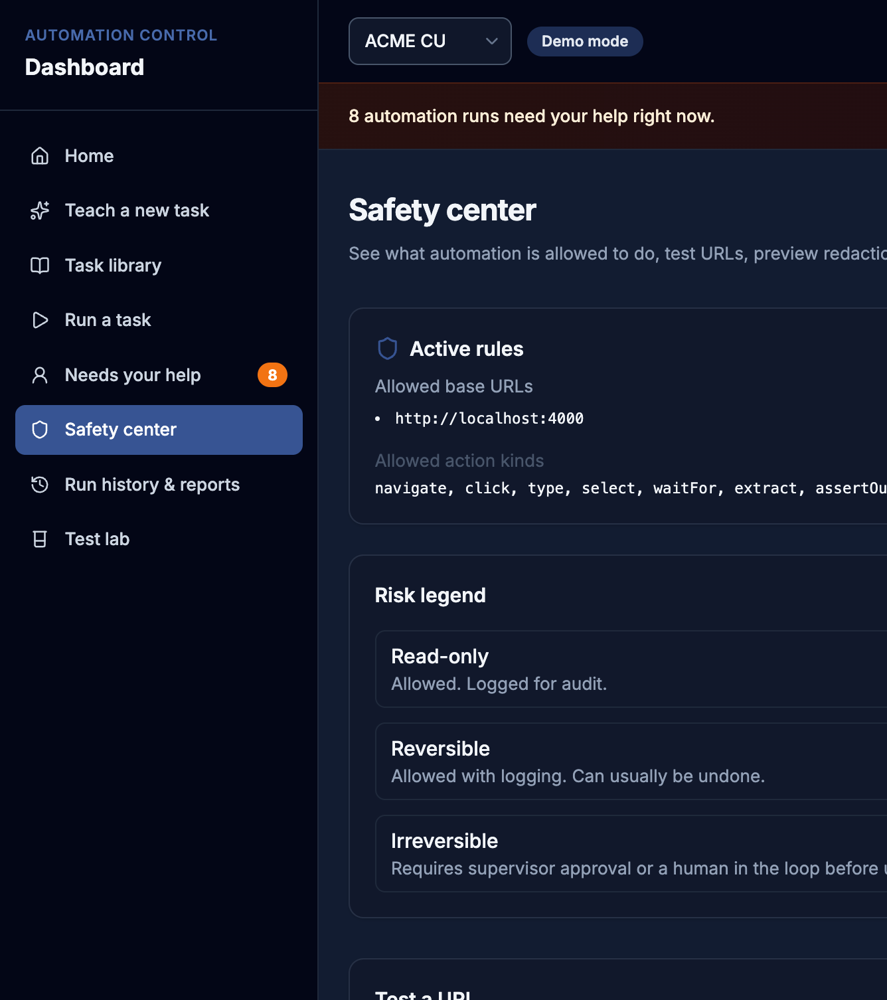

# Hands for an AI agent — discovery once, replay forever

**interface.ai Software Engineer assignment** (BankGPT / computer-use layer)

This repo is the layer that gives an AI agent **hands** on a real UI that has **no API**.

1. An LLM (Gemini) works out how to finish a task inside a hostile legacy bank console (**CoreServ**).
2. The successful run is saved as a typed **capability artifact** (ranked locators, inputs, outcomes, risk class).
3. That capability **replays deterministically with no model in the loop**.

Replay never imports the LLM client (enforced by unit test). Credentials never go on the CLI — they live in `.env`.

| Assignment ask | What this repo does |
|----------------|---------------------|
| Agent completes a task in a real UI with no API | Playwright drives CoreServ (unlabeled login, frames, decoys, faults) |
| Successful run → reusable capability | JSON artifacts under `artifacts/` (schema 1.1) |
| Replay with no LLM | `npm run replay` / dashboard **Run a task** |
| Human when stuck | Claim → act on the same browser → resume |
| Safety for bank data | URL allowlist, redaction, irreversible writes stay **draft** until approve |

**Author:** Archi Agrawal · [github.com/ArchieAgrawal01/ui-automation](https://github.com/ArchieAgrawal01/ui-automation)

---

## Why this is a good fit

Banks still run work in **core systems that were never built for APIs**. The useful move is not “put GPT on every click.” It is:

- **Learn once** in the messy UI (with a model).
- **Run many times** as a reviewed, allowlisted script (without a model).
- **Hand off to a human** on the same session when the UI drifts, MFA appears, or a write is irreversible.
- Treat **“member not found”** as a valid business answer, not a crash.

The operator dashboard is what a credit-union employee would use. CoreServ is the adversarial target — on purpose ugly, not restyled.

<p align="center">
  
  
</p>

*Left: CoreServ — the real target (no test IDs, unlabeled fields). Right: operator dashboard — teach, run, hand off, safety.*

---

## 10-minute review path (no Gemini required)

Replay, safety, and handoff work **without** an API key. Discovery is the only step that calls Gemini.

### 1. Install (once)

Needs **Node 22+** (`node -v`).

```bash
git clone https://github.com/ArchieAgrawal01/ui-automation.git
cd ui-automation
cp .env.example .env
# Optional: paste GEMINI_API_KEY from https://aistudio.google.com/apikey  (discovery only)
npm install
npx playwright install chromium
npm run seed
```

### 2. Start two processes

**Terminal 1 — CoreServ (bank console)**

```bash
ENABLE_TEST_HARNESS=1 npm start
# http://localhost:4000/login
```

**Terminal 2 — operator dashboard**

```bash
npm run dashboard
# http://localhost:5000
# macOS AirPlay often occupies 5000 → automatic fallback http://localhost:5050
```

Demo login for CoreServ: **`csr1` / `csr-pass`** (check “terms of use”, then Login).  
Dashboard has no login (demo mode).

### 3. Click through the workflow

| Minutes | Open | What to notice |
|--------:|------|----------------|
| 1 | CoreServ `/login` | Hostile target. Member **12345** → savings **$4,321.09** after login. |
| 2 | Dashboard **Home** | Live health, library size, “need your help” inbox. |
| 3 | **Task library** | Saved capabilities. Open `lookup_member_savings_balance`. |
| 4 | **Run a task** | Task = lookup, member **12345** → Success **$4,321.09**. No AI badge. |
| 5 | Same screen, member **99999** | Blue **business outcome** (`MEMBER_NOT_FOUND`), not a failure. |
| 6 | **Needs your help** | Stuck runs pause here. Claim → fix → hand back. |
| 7 | **Safety center** | Allowlist, risk classes, redaction preview, draft approvals. |
| 8 | **Test lab** | Guided checklist + simulated faults. |

Minute-by-minute click script: [`docs/INTERVIEW_DEMO.md`](docs/INTERVIEW_DEMO.md). CLI-only path: [`docs/DEMO.md`](docs/DEMO.md).

---

## How the workflow works

```
  Teach (Gemini + Playwright)          Save                         Run (no LLM)
 ┌──────────────────────────┐     ┌──────────────┐     ┌────────────────────────────┐
 │ Observe accessibility    │     │ Capability   │     │ Resolve ranked locators    │
 │ Decide next action       │ ──► │ artifact     │ ──► │ Assert typed outcomes      │
 │ Act on CoreServ          │     │ JSON 1.1     │     │ Evidence + screenshots     │
 │ Until checkpoint         │     │ + evidence/  │     │ Drift / tenant overrides   │
 └────────────┬─────────────┘     └──────────────┘     └─────────────┬──────────────┘
              │                                                       │
              │  stuck / MFA / irreversible                           │
              └──────────────────► Human handoff ◄────────────────────┘
                                   same browser session
                                   claim → act → resume
```

### 1. Teach a new task (discovery)

Plain-English goal. Gemini sees the page, chooses an action, Playwright executes it, until the checkpoint (e.g. extract `savingsBalance`). Transcript lands in `evidence/<runId>/`.



Live teach needs `GEMINI_API_KEY`. For a short review, show **Run preflight**, then open an existing artifact in the library (seeded lookup is already there).

```bash
npm run discover -- --memberId 12345 --headless
```

### 2. Task library (the reusable capability)

The artifact is the product: ranked locators + rationale, typed inputs, `risk_class`, fingerprint, tenant overrides. Irreversible writes stay **draft** until a supervisor clicks **Approve for replay**.




### 3. Run a task (deterministic replay)

No LLM. Same artifact, new inputs. Member `12345` is the happy path; `99999` is a declared outcome.


```bash
npm run replay -- --seeded --memberId 12345 --headless
# → success, savingsBalance "$4,321.09"

npm run replay -- --seeded --memberId 99999 --headless
# → business_outcome MEMBER_NOT_FOUND
```

### 4. Needs your help (human on the same session)

If locators fail, the run **pauses** instead of crashing. An operator claims it, acts in the headed Chromium window, and hands control back. Automation continues from a fresh observe.



```bash
npm run demo-handoff    # headed claim → act → resume
```

### 5. Safety center

Allowed host is CoreServ. Actions are classified read-only / reversible / irreversible. Evidence is redacted (SSN, email, passwords). Screenshots are **not** pixel-scrubbed (honest limit).



### 6. History, reports, test lab

Every run writes evidence. Reports are printable. Test lab arms CoreServ faults (`/__test/faults`) so you can show HTTP 500 → `hard_failure` without waiting for a real outage.


---

## Result taxonomy

| Status | Meaning |
|--------|---------|
| `success` | Checkpoint hit + typed outputs (e.g. `$4,321.09`) |
| `business_outcome` | Expected domain result (`MEMBER_NOT_FOUND`, permission denied) |
| `recovered` | Success after a bounded recoverable path (e.g. re-auth) |
| `needs_human` | Paused; claim → fix → resume |
| `hard_failure` | Crash / locator / allowlist / HTTP 5xx, with evidence paths |

---

## CLI cheat sheet

Credentials: `.env` only (`CORESERV_USER`, `CORESERV_PASS`, `GEMINI_API_KEY`).

```bash
npm run replay -- --seeded --memberId 12345 --headless
npm run replay -- --seeded --memberId 12345 --tenant harborview --headless
npm run stability -- --seeded --n 5 --memberId 12345
npm run replay -- --seeded-write --memberId 12345 --headless   # needs_human until approve
npm run approve -- --artifact seeded-open-account-draft

npm test
```

---

## Architecture

```
src/core/agent/       Gemini discovery → transcript → artifact
src/core/artifact/    schema 1.1 builder + validate-on-load
src/core/replay/      locators, outcomes, drift, tenant overrides
src/core/surface/     SurfaceAdapter + PlaywrightWebAdapter
src/core/escalation/  PAUSED → claim HUMAN → resume
src/core/safety/      allowlist + redaction + irreversible draft gate
src/dashboard/        operator UI (Express + React) on :5000 / :5050
src/mock-app/         CoreServ (SQLite, frames, faults, tenants)
artifacts/            capability JSON
evidence/             run logs and screenshots
schemas/              capability.schema.json
```

CoreServ tenants: `TENANT=meridian` (default), `harborview` (label/menu drift), `tiny_cu` (lite shell).

---

## What is verified vs not

Observed results: [`VERIFY.md`](VERIFY.md). Design choices: [`REPORT.md`](REPORT.md).

**PASS:** discovery → artifact → replay on CoreServ; seeded lookup; business outcome; harborview; stability; HTTP 500 → `http_5xx`; live handoff; write draft gate.

**Not claimed:** full iframe `/console` E2E (seeded path uses top-level `/app/*` after login); pixel-scrubbed screenshots; in-page remote co-browse (handoff is headed Chromium + dashboard).

---

## Deeper docs

| Doc | Use |
|-----|-----|
| [`docs/INTERVIEW_DEMO.md`](docs/INTERVIEW_DEMO.md) | 10-minute click script |
| [`docs/DASHBOARD.md`](docs/DASHBOARD.md) | Operator UI map |
| [`docs/DEMO.md`](docs/DEMO.md) | CLI demo order (Gemini last) |
| [`TASKS.md`](TASKS.md) | Graded task list |
